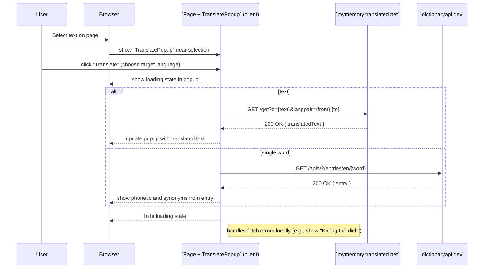

**Sequence Diagram: Highlight Text → Translate (client-only)**

Purpose: user highlights text and the frontend calls external translation/dictionary APIs directly (no server involved). This diagram excludes copy, save, and read features.

References: `client/src/component/TranslatePopup.jsx`.
